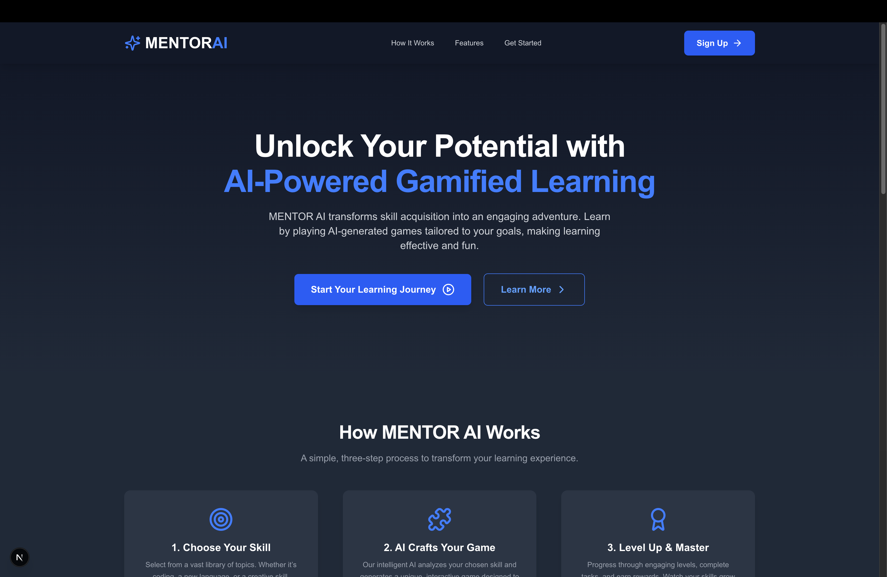
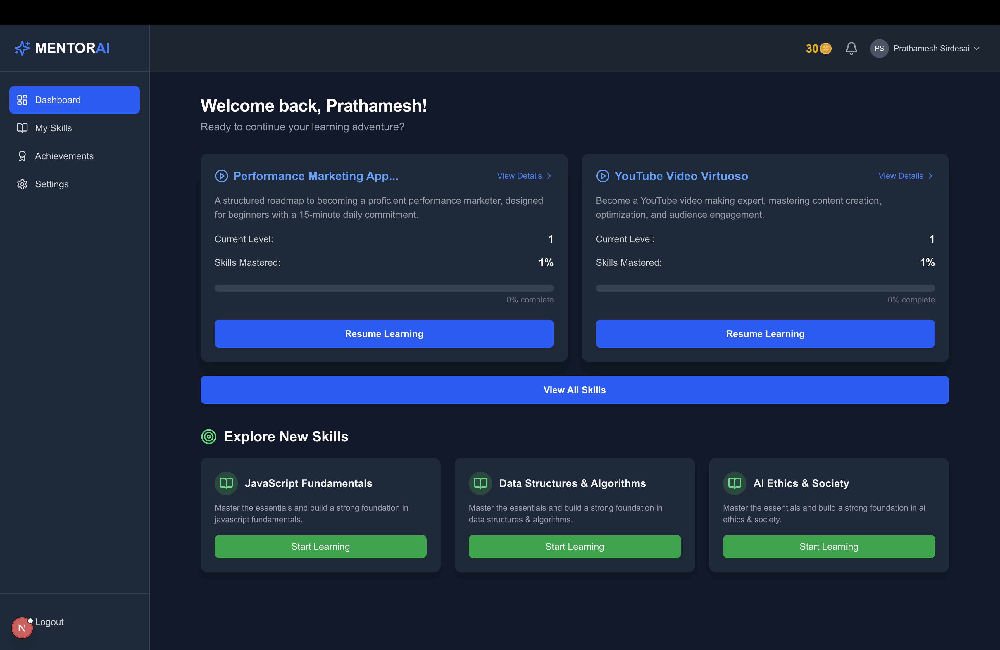
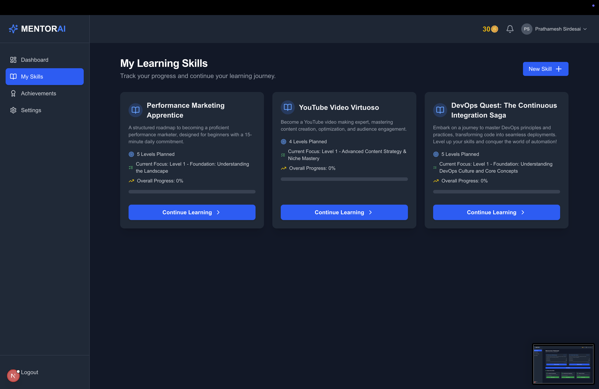
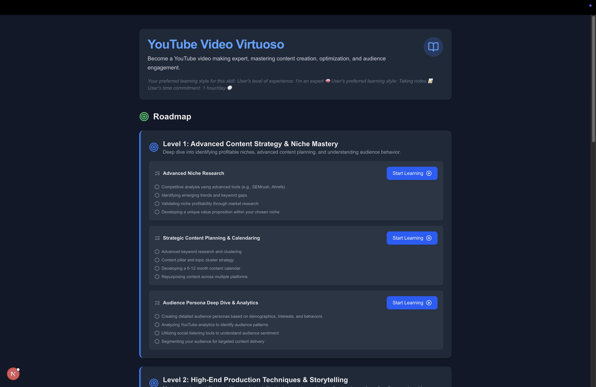

# 🎓 Mentor AI – Your Personal AI-Powered Learning Mentor

Mentor AI is an AI-powered educational platform that helps you learn anything—customized just for you. Whether you want to master a programming language, understand complex topics, or explore something new, Mentor AI generates a personalized roadmap based on your **goals**, **learning style**, and **available time**.

---

## ✨ Features

- ✅ **Personalized Learning Path**  
  Generates a custom roadmap tailored to your skill level, goals, and preferred learning style (videos, articles, practice-based).

- 🧠 **AI-Generated Content**  
  Lessons, summaries, quizzes, and examples are generated using Gen AI in real time.

- 🔗 **Smart Resource Mapping**  
  Links every topic to handpicked YouTube videos, blogs, documentation, and MOOC platforms.

- 📆 **Google Calendar Integration**  
  Auto-schedules your roadmap into your calendar based on the hours you can give per day.

- 🧩 **Gamified Learning Dashboard**  
  Track your progress with levels, XP, streaks, and a motivational progress system.

- 📚 **Multi-Topic Support**  
  Learn multiple skills at once with individual roadmaps, tasks, and progress indicators.

---

## 🚀 How It Works

1. **Login/Register** via email or Google.
2. **Pick a Topic** you want to learn (e.g., Web Development, Machine Learning).
3. **Answer a Few Questions** about your current level, goals, learning style, and available time.
4. **Get Your Roadmap** with tasks broken down into Levels → Subtopics → Microtasks.
5. **Start Learning!** Use AI-generated tasks, complete quizzes, explore mapped resources, and track your progress.

---

## 🛠 Tech Stack

- **Frontend**: React / React Native (Web & Mobile)
- **Backend**: Node.js / Express or Go
- **Database**: MongoDB / PostgreSQL
- **AI Integration**: OpenAI API (GPT-4/4o)
- **Auth**: Firebase / OAuth
- **Calendar Sync**: Google Calendar API
- **Deployment**: Vercel / Render / Firebase Hosting

---

## 📸 Screenshots









---

## 📦 Installation

```bash
# Clone the repo
git clone https://github.com/sirdesai22/mentor_ai.git
cd mentor_ai

# Install dependencies
npm install

# Run the app
npm run dev
